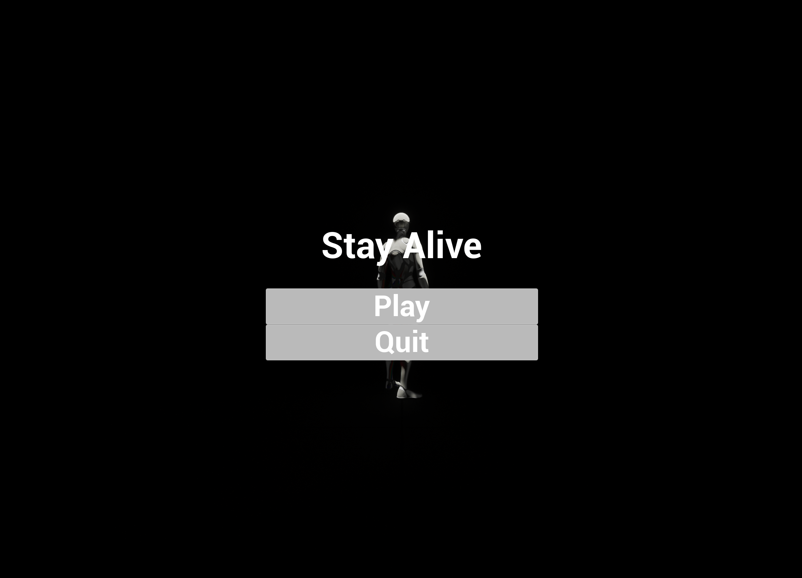
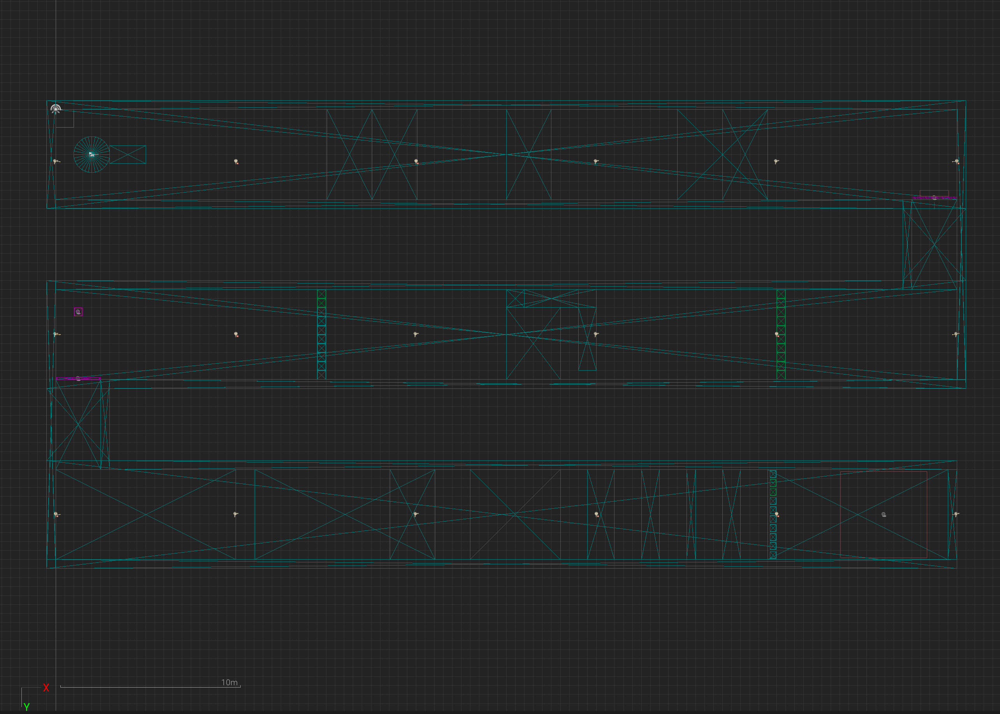
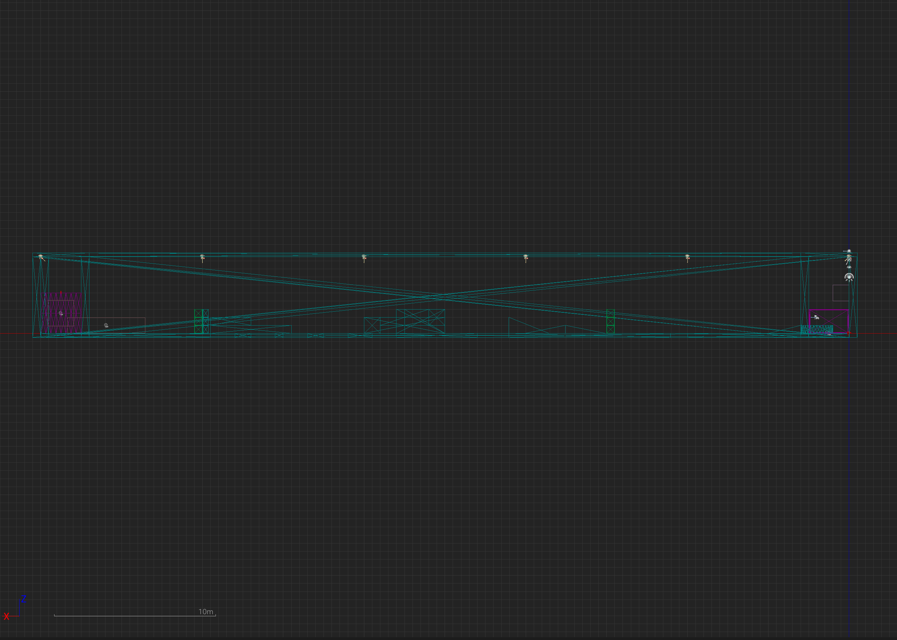
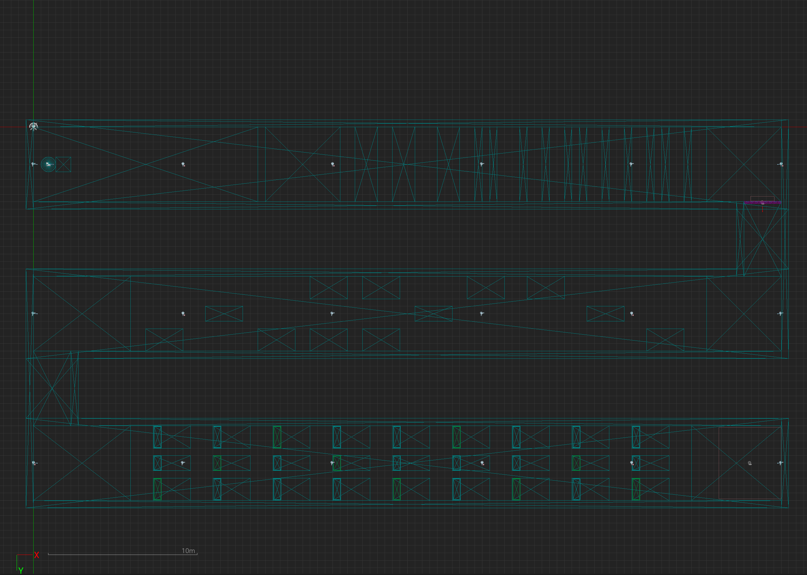
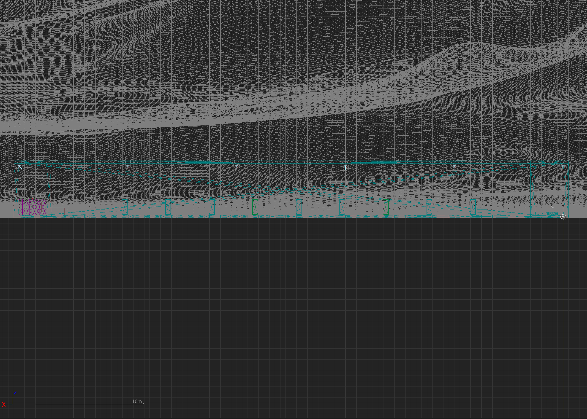
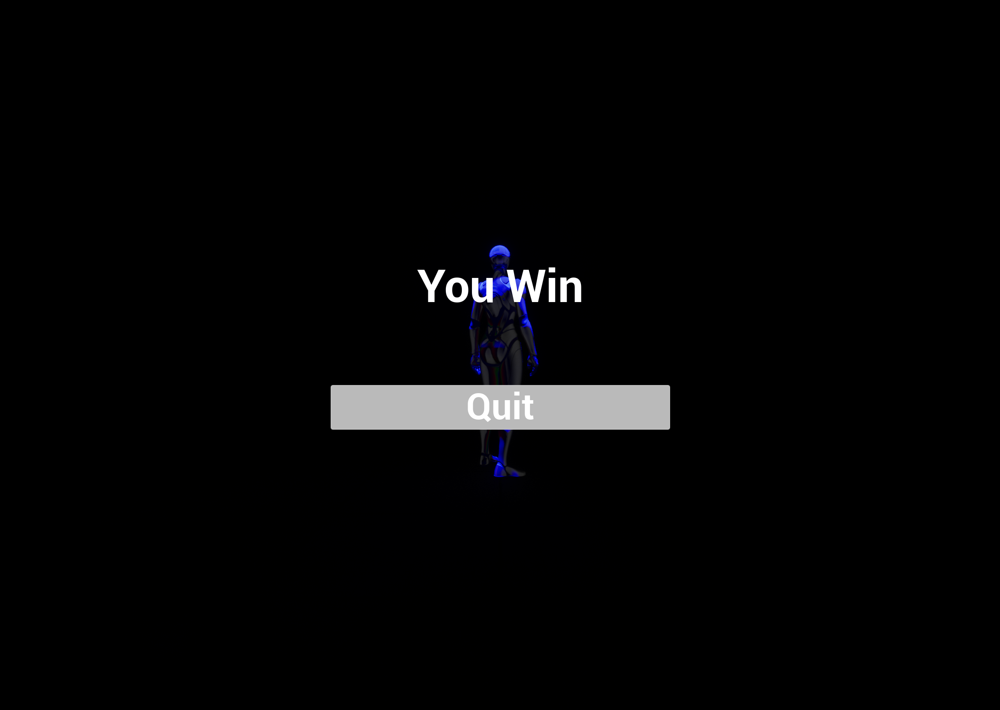
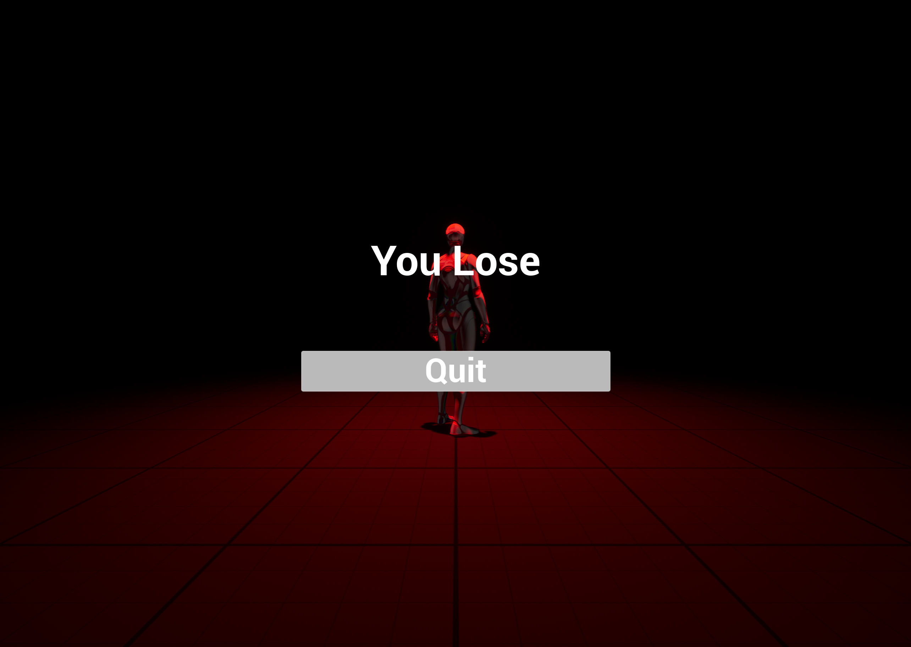

# Stay Alive

**This is a game that you play by staying alive and trying the beat the game by clearing two stages. You have three 
tries.**

## Game screen 🎮
### Menu 🖥️

### Level 1️⃣

<table>
    <tbody align="center">
        <tr>
            <td colspan="2"></td>
        </tr>
        <tr>
            <td>Top View</td>
            <td>Left View</td>
        </tr>
        <tr>
            <td></td>
            <td></td>
        </tr>
    </tbody>
</table>

### Level 2️⃣

<table>
    <tbody align="center">
        <tr>
            <td colspan="2"></td>
        </tr>
        <tr>
            <td>Top View</td>
            <td>Left View</td>
        </tr>
        <tr>
            <td></td>
            <td></td>
        </tr>
    </tbody>
</table>

### Ending 🎯

<table>
    <tbody align="center">
        <tr>
            <td>Win</td>
            <td>Lose</td>
        </tr>
        <tr>
            <td></td>
            <td></td>
        </tr>
    </tbody>
</table>
